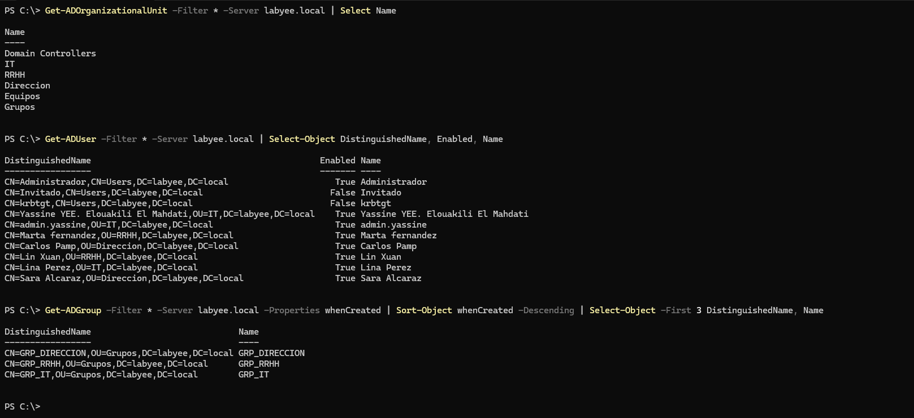
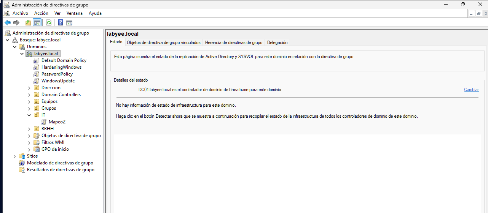
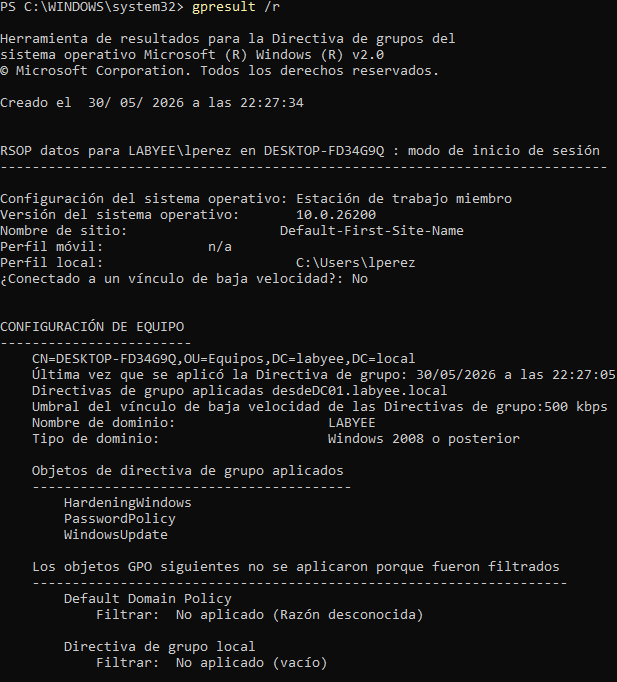
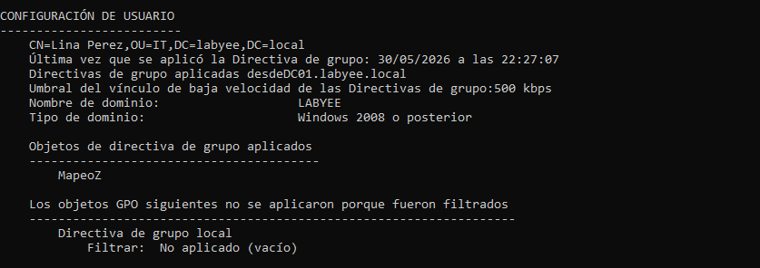
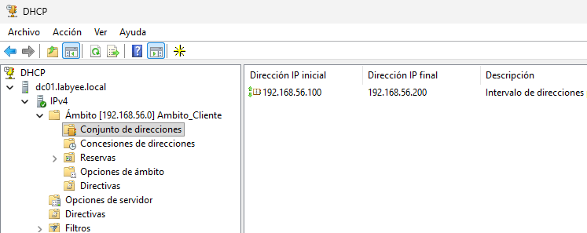
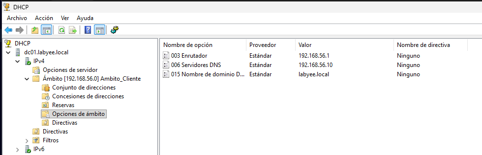
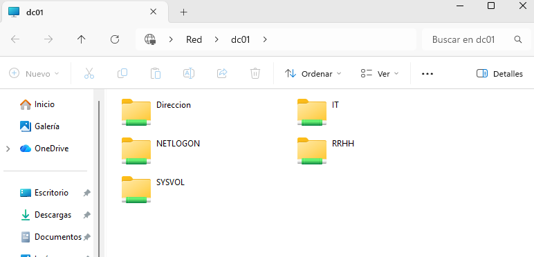
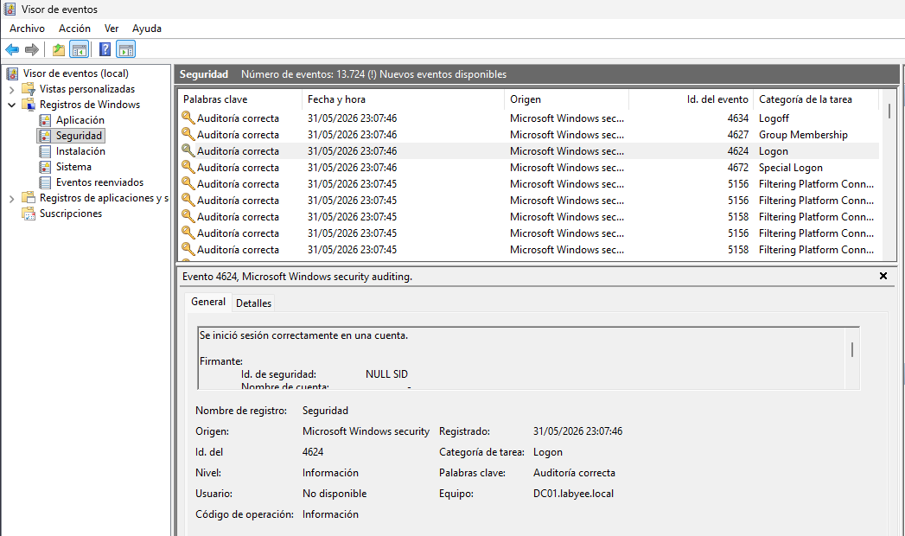
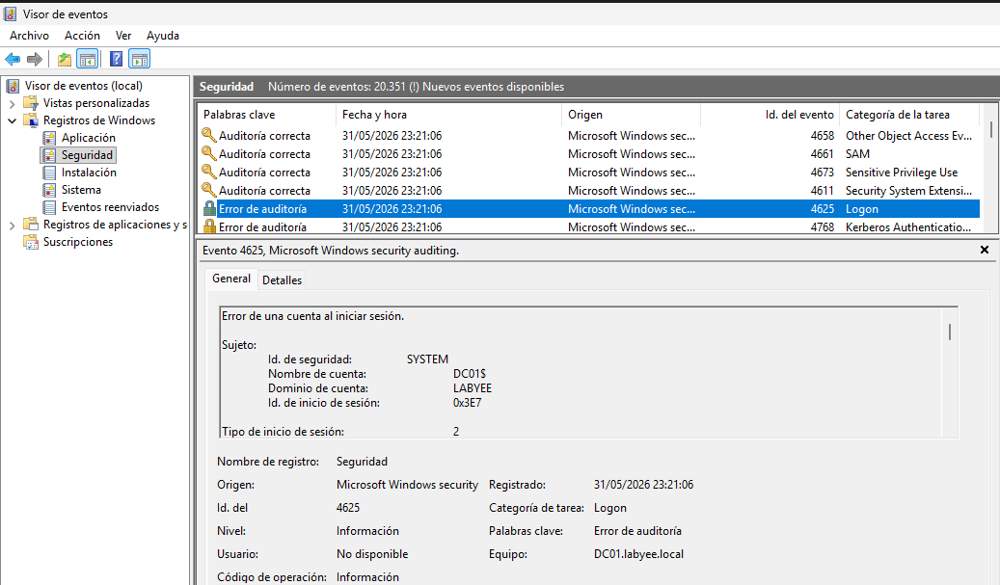

# Entorno Corporativo hibrido: Active Directory + Azure Entra ID

Laboratorio profesional que simula la infraestructura híbrida de identidades de una empresa mediana: Active Directory on‑premise con Windows Server 2025, sincronizado con Azure Entra ID mediante Entra Connect, con políticas de seguridad Zero Trust, MFA, Conditional Access, Identity Protection, PIM, Access Reviews y administración cloud con RBAC, Azure Policy, Storage y Monitor.

---
## Índice
- [Arquitectura](#arquitectura)
- [Tecnologías](#tecnologías)
- [Fases del proyecto](#fases-del-proyecto)
- [Verificación](#verificación)
- [Scripts PowerShell](#scripts-powershell)
- [Documentación detallada](#documentación-detallada)


---
## Arquitectura

```
┌─────────────────────────────────────────────┐
│                                             │
│  ┌─────────────────┐   ┌─────────────────┐  │
│  │   DC01          │   │   WIN10 / WIN11 │  │
│  │   Windows       │◄──│   Clientes      │  │
│  │   Server 2025   │   │   del dominio   │  │
│  │                 │   │                 │  │
│  │  · AD DS        │   │ · GPOs aplicadas│  │
│  │  · DNS          │   │ · Unidad Z:     │  │
│  │  · DHCP         │   │   mapeada       │  │
│  │  · File Server  │   │                 │  │
│  │  · Entra Connect│   └─────────────────┘  │
│  └────────┬────────┘                        │
└───────────┼─────────────────────────────────┘
            │ Sincronización (Entra Connect)
            ▼
┌─────────────────────────────────────────────┐
│                  Azure                      │
│                                             │
│  Entra ID                                   │
│  · Usuarios sincronizados                   │
│  · MFA · Conditional Access                 │
│  · Identity Protection · PIM                │
│  · Access Reviews (Governance)              │
│  · Entra Connect Health                     │
│                                             │
│  Administración cloud                       │
│  · Resource Groups · RBAC                   │
│  · Azure Policy · Storage Account           │
│  · Azure Monitor + Alertas                  │
└─────────────────────────────────────────────┘
```

**Red interna:** `192.168.56.0/24`  
**Dominio:** `labyee.local`  
**DC01:** `192.168.56.10`  
**Clientes DHCP:** `192.168.56.100–200`

---

## Fases del proyecto

| Fase | Descripción | Área |
|------|-------------|------|
| 1 | Preparación del entorno (VirtualBox + ISOs + Azure) | Setup |
| 2 | AD DS, DNS, OUs, usuarios, grupos | On‑premise |
| 3 | GPOs corporativas (5) | On‑premise |
| 4 | DHCP, File Server, auditoría | On‑premise |
| 5 | Scripts PowerShell | Automatización |
| 6 | Entra Connect + PHS + Seamless SSO | Híbrido |
| 7 | MFA + Conditional Access (Zero Trust) | Seguridad |
| 8 | Identity Protection + PIM + Access Reviews | Governance |
| 9 | Azure: RBAC, Policy, Storage, Monitor | Cloud |
| 10 | Hardening: bloqueo de legacy auth, roles admin separados | Seguridad |

---
## Tecnologías

| Capa | Tecnología |
|------|-----------|
| Virtualización | VirtualBox |
| Servidor | Windows Server 2025 | 
| Clientes | Windows 11 Enterprise | 
| Directorio | AD DS | 
| DNS/DHCP | Integrado en AD | 
| File Server | SMB + NTFS | 
| Políticas | GPO | 
| Automatización | PowerShell | 
| Sincronización | Entra Connect + Connect Health |
| Identidad cloud | Entra ID |
| MFA | Entra MFA |
| Conditional Access | Zero Trust |
| Identity Protection | Riesgo de usuario/sesión |
| PIM | Roles Just‑In‑Time |
| Governance | Access Reviews |
| RBAC | Azure IAM |
| Azure Policy | Gobernanza |
| Storage | Blob + SAS |
| Monitorización | Azure Monitor |

---

## Verificación

### Active Directory — estructura de OUs y usuarios

*Active Directory Users and Computers: OUs IT, RRHH y Direccion con usuarios y grupos creados*

### Group Policy Objects — GPOs vinculadas

*Group Policy Management Console: 4 GPOs corporativas vinculadas a sus OUs correspondientes*

### GPOs aplicadas en cliente


*Resultado de `gpresult /r` en WIN11 mostrando las GPOs aplicadas correctamente*

### DHCP — scope activo con leases


*Scope 192.168.56.100–200 activo*

### File Server — permisos NTFS configurados

*Carpetas creadas mostradas desde punto vista de un administrador `\\DC01`*

### Event Viewer — eventos de seguridad
- 4624: inicio de sesión exitoso


- 4625: fallo de autenticación


*Event ID 4624 (login exitoso) y 4625 (fallo de autenticación) en el Security log*
---

## Scripts PowerShell

Añadidos:

| Script | Descripción |
|--------|-------------|
| `New-UsersFromCSV.ps1` | Creación masiva de usuarios desde CSV |
| `Get-InactiveUsers.ps1` | Usuarios sin login en los últimos 30 días |
| `Backup-GPOs.ps1` | Exporta todas las GPOs con fecha |
| `Get-DomainInventory.ps1` | Inventario de equipos: nombre, IP, SO, última conexión |
| `Test-CriticalServices.ps1` | Verifica que AD DS, DNS y DHCP están activos |


---
## Documentación detallada
| Documento | Contenido |
|------|-----------|
| [`docs/fase-2-active-directory.md`](/docs/fase-2-active-directory.md) | AD DS, DNS, OUs, usuarios, grupos, unión al dominio |
| [`docs/fase-3-gpo.md`](docs/fase-3-gpo.md) | Las 4 GPOs: configuración, vinculación y verificación |
| [`docs/fase-4-dhcp-fileserver-auditoria.md`](docs/fase-4-dhcp-fileserver-auditoria.md)| DHCP, File Server con NTFS, Event IDs de seguridad |
| [`docs/fase-5-powershell.md`](docs/fase-5-powershell.md) | Scripts: descripción, uso y ejemplos de output |


---

Autor:
**Yassine Elouakili El Mahdati**
