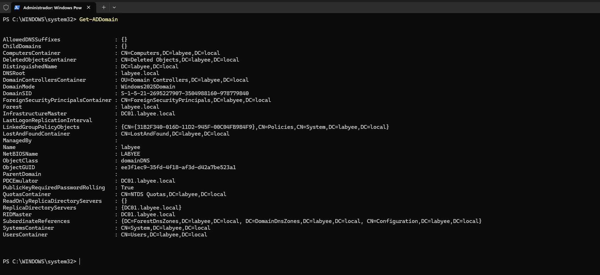
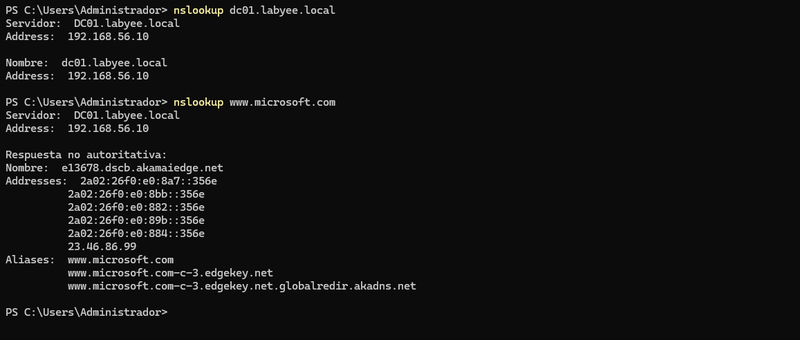
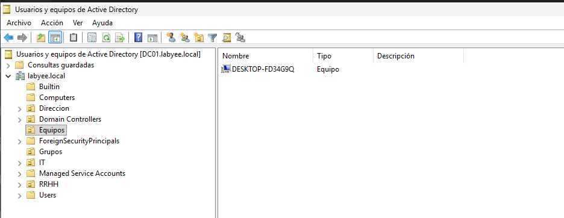

# Fase 2 — Active Directory: AD DS, DNS, OUs, Usuarios y Grupos

## 1. Instalación de AD DS

### Pasos
1. Instalar el rol:
   - Server Manager → Add Roles and Features
   - Active Directory Domain Services
2. Promover a controlador de dominio:
   - Add a new forest
   - Dominio: `labyee.local`
3. Reiniciar y validar:
   - `dcdiag`
   - `Get-ADDomain`

## 2. DNS integrado en AD

### Configuración
- Zona principal: `labyee.local`
- Zona inversa: `56.168.192.in-addr.arpa`
- Forwarders: DNS al servidor (192.168.56.10) y 1.1.1.1

### Verificación
```
nslookup dc01.labyee.local
nslookup [www.microsoft.com](http://www.microsoft.com)
```


## 3. Estructura de OUs

```
labyee.local
 ├── IT
 ├── RRHH
 ├── Direccion
 ├── Equipos
 └── Grupos
```

## 4. Creación de usuarios y grupos

### Usuarios
- `yassine` (IT)
- `lperez` (IT)
- `admin.yassine` (cuenta administrativa)
- `mmellado` (RRHH)
- `lxuan`(RRHH)
- `cpamp`(Dirección)
- `salcaraz` (Dirección)

### Grupos
- `GRP_IT`
- `GRP_RRHH`
- `GRP_DIRECCION`


## 5. Unión de clientes al dominio

### Comando
```
Add-Computer -DomainName labyee.local -Credential labyee\admin.yassine -Restart
```

## 6. Verificación

- Muestra OUs, grupos y usuarios

- Equipos aparecen en OU “Equipos”

