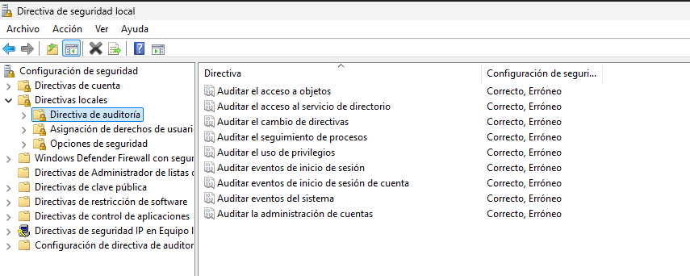

# Fase 4 — DHCP, File Server y Auditoría

## 1. DHCP

### Configuración del scope
- Rango: 192.168.56.100–200
- Gateway: 192.168.56.1
- DNS: 192.168.56.10

## 2. File Server

### Carpetas
- `\\DC01\IT`
- `\\DC01\RRHH`
- `\\DC01\Direccion`

### Permisos NTFS
- IT → Full Control
- RRHH → Modify
- Dirección → Read

## 3. Auditoría de seguridad

### Activación
- Local Security Policy → Audit Policy
- Success + Failure

### Eventos clave
- 4624: inicio de sesión exitoso

- 4625: fallo de autenticación
