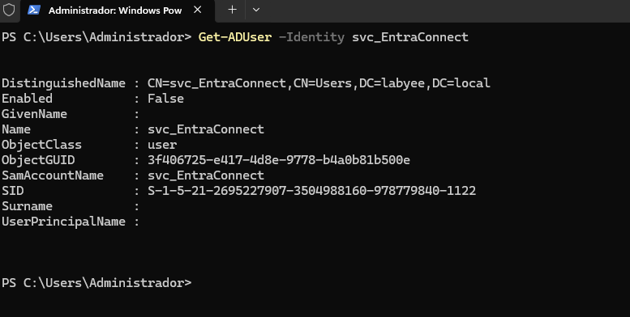
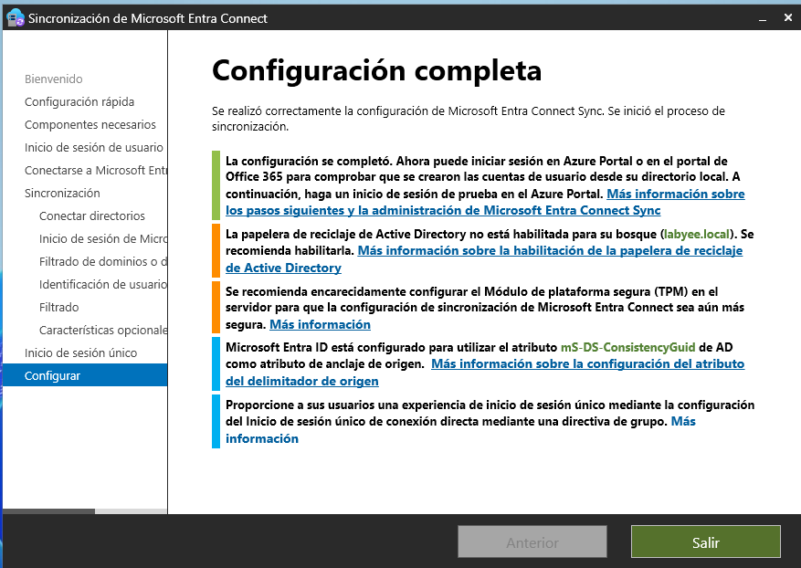

# FASE 6 — Microsoft Entra Connect + Sincronización híbrida

Esta fase tiene 3 objetivos:

1. **Sincronizar Active Directory on‑premise con Azure Entra ID**  
2. **Habilitar Password Hash Sync (PHS)**  
3. **Activar Seamless Single Sign‑On (SSO)**  

---

## 1. Preparación en Azure

### 1.1. Crear tenant de Azure Entra ID
En [https://entra.microsoft.com](https://entra.microsoft.com):

- Crear tenant → *Microsoft Entra ID*
- Nombre:  
  ```
  Labyee Cloud
  ```
- Dominio inicial:  
  ```
  labyee.onmicrosoft.com
  ```

### 1.2. Crear usuario administrador global

```
admin.yassine@labyee.onmicrosoft.com
```
Asignar rol:
- **Global Administrator**

### 1.3. Activar licencias necesarias
Para todo se va a usar:

- Entra ID P2

Esto habilita:
- Identity Protection  
- PIM  
- Conditional Access avanzado  
- Access Reviews  
- MFA  
- Risk-based policies  
- Etc


---

## 2. Preparación en el DC01

### 2.1. Crear OU para sincronización
En AD:

```
labyee.local
 └── CloudSync
      ├── IT
      ├── RRHH
      └── Direccion
```


### 2.2. Crear cuenta de servicio para Entra Connect
En PowerShell:

```
New-ADUser -Name "svc_EntraConnect" -SamAccountName "svc_EntraConnect" -AccountPassword (Read-Host -AsSecureString) -Enabled $true
```

Asignar permisos mínimos:
- Replicating Directory Changes  
- Replicating Directory Changes All  

---


## 3. Instalar Microsoft Entra Connect
Instalar Entra Connect desde el portal de Entra

1. Ejecutar instalador  
2. Seleccionar:
   - **Password Hash Sync (PHS)**  
   - **Seamless Single Sign‑On (SSO)**  
3. Iniciar sesión con:
   ```
   admin.yassine@labyee.onmicrosoft.com
   ```
4. Seleccionar OU:
   ```
   labyee.local/CloudSync
   ```
5. Finalizar


---

## 4. Verificación de sincronización

### 4.1. En Azure Entra ID
```
Entra ID → Users
```


Con confirmación de sincronización.


### 4.2. Entra Connect Health
Ir a:
```
Entra ID → Connect → Connect Health
```

- DC01 saludable  
- Última sincronización < 5 minutos  

